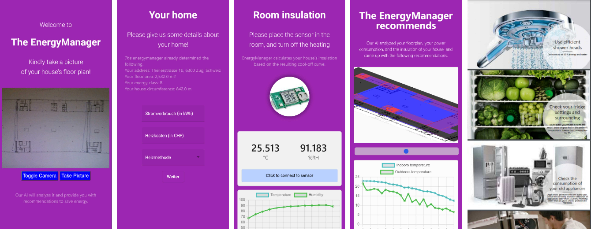

# EnergyManager

HackZürich2022 - A tool for digital energy consulting!

**Installation**

Node is required to execute the frontend. For the backend, install required Python packages with
```
cd energymanager
pip install -r requirements.txt
```



**Motivation**

Europe is facing the most serious energy crises in decades. In light of exploding gas and energy prices, everyone is desperately looking for possibilities to reduce their heat consumption or improve their generation. However, the experts who can advise people about possible improvements are booked out for months. Being consulted by an energy consultant is expensive and currently scarce. We solve this problem with our digital tool, the EnergyManager.

The EnergyManager is an app that pools information from (paper-format) floor plans, installed sensors and a questionnaire, and provides targeted advice on how to save energy.

It works, and it's easy: 

Take a picture of your floor plan

Enter a few things about your energy usage

Measure your home insulation and energy consumption by placing a sensor in any room and turning off the heater for 24h hours.

Our revolutionary AI algorithm then takes over: It extracts your home size, shape, room layout and address directly from the floor plan, combines it with your energy usage indications, and augments it with the auto-measurements from the Sensirion sensor.

From this, it provides you with an overview over which rooms are particularly suited for energy-saving improvements, and presents it on an easily understandable 3D map! Based on your home's size and location, it proposes solar panel installations and battery storage, and automatically computes its energy class (A-F).

Finally, you'll receive custom-tailored recommendations on how to easily and quickly start saving energy in the form of an exciting PowerPoint presentation! 

All that, conveniently from your pocket, in a well-designed app. Why, you ask? To keep winter at bay (and also because energy managers and consultants are booked out for the whole next year, so it's about time we digitize the process)!

**Technical details**:

All code can be found on our GitHub page: https://github.com/mie-lab/energymanager. We employ Angular for the frontend implementation and connect it via Flask with a Python backend. The laptop (or another device) camera can be used to take a picture, which is sent to the backend. The image is segmented with a pre-trained segmentation model, which automatically labels rooms. Secondly, the image is parsed with an OCR library to extract text. We automatically find scale- and format-information in the text and use it to compute the real-world living space dimension, as well as wall lengths. 

On the other hand, we enable the user to contribute information about insulation themselves by collecting temperature data with sensors. Given the gradient of temperature decrease in a non-heated room, we compute the heat loss per wall-squaremeter, which is a main factor deciding on the building energy certificate. The backend returns the floor area, building address, the presumable energy certificate, and a heatmap overlay of the room structure to the front end. The data is displayed in a sensor data animation and a 3D floor plan model.

**Further work**:

In the next step, we plan to integrate an assessment of solarpanel-potential based on the home address and estimated roof size. We believe that many further factors could be integrated, in particular in collaboration with experts. 


